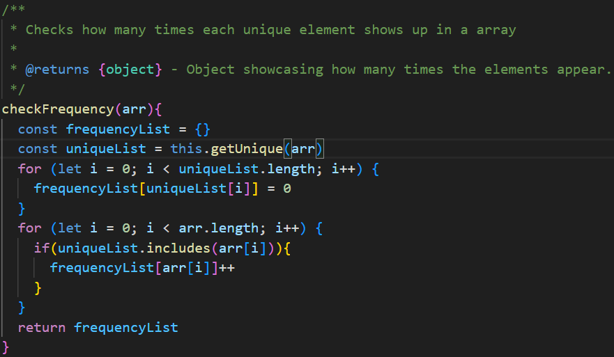
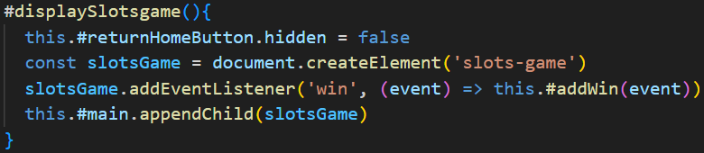

# Reflektion

### Kapitel 2 - Meaningful Names
Detta kapitlet har hjälpt mig mycket när det gäller att göra bättre namn till funktioner, variabler och annat. Skulle säga att jag håller med vad som står i boken och kommer att använda dessa regler i framtiden.

### Kapitel 3 - Functions
Igen ett väldigt bra kapitel som har hjälpt mig. Jag har försökt använda dessa kunskaper så bra som jag kan men vissa saker känner jag kan vara svåra att implementera.

Ett exempel på några som är svår är "Do one thing" och "One Level of Abstraction per Function"

[](imgs/spinSlots.png)

Funktionen "#spinSlots" skulle behövas förbättras enligt dem reglerna men det måste vara fler. Jag vet att det är dåligt att ha flera if satser i varandra men det enda alternativet jag kommer på är att ha en till funktion som kollade om det är vinst och om det är det skicka iväg ett event men det skulle då bryta mot "Do one thing" och det skulle bli ett dåligt namn som "checkAndSendEventIfWin".

### Kapitel 4 - Comments

I L3 har jag försökt att ha beskrivande namn och "Clean code" för att då inte ha några kommentarer men i L2 så har det blivit några kommentarer där jag tycker att det har blivit nödvändigt.

[](imgs/checkFrequency.png)

Jag vet inte hur jag kan göra ett bra nog namn för att man ska förstå vad funktionen gör utan att namnet blir väldigt långt. Så islutändan känner jag att detta är just nu den bästa lösningen jag kommer på.

### Kapitel 5 - Formatting

Bra kapitel. Känner att den säger ändå ganska självklara saker med att inte ha för långa kodrader och att kod som jobbar tillsammans ska ligga nära varandra. Har alltid försökt följa dessa regler eftersom det känns naturligt att lägga upp koden på ett sådant sätt.

### Kapitel 6 - Objects and Data Structures
Intressant kapitel som pratar om "encapsulating" och "Law of Demeter" vilket då är om vad för data som ska gömmas och vilka klasser/objekt som ska ha tillgång  till dem. Jag har försökt till det bästa av mina kunskaper att följa dessa koncept och tycker personligen att jag har fått till det på ett relativt bra sätt.

[](imgs/displaySlotsgame.png)

När jag tänker på det nu så skulle nog game-center haft variabler för dem olika sakerna den visar istället för att bara lägga in dem.

### Kapitel 7 - Error Handling
Väldigt bra kapitel. Min kod använder sig inte av någon "Error Handling" eller "Try-catch" alls vilket inte är bra men jag är osäker på var jag skulle lägga in det. Troligtvis i en funktion som tar en parameter men allting är ganska hårdkodat så det känns inte så nödvändig. Men jag skulle ändå ha velat lagt till hantering av error, dock dock på grund av tidsbrist så hände det inte.

### Kapitel 8 - Boundaries
Bra kapitel på hur man ska hantera "Tredje part" kod/ kod som någon annan håller i. Den enda "Tredje part" kod som jag använder är min egen arrayhelper och jag tycker jag hanterar den bra. I boken så står det om att skapa en klass som då tar hand om en "Tredje part" kod men jag tycker att det inte är nödvändigt när det kommer till arrayhelpern.

### Kapitel 9 - Unit Tests
Kapitlet tar upp många bra saker om testkod och jag känner att den har gett mig mycket kunskap om hur man ska på bra sätt göra automatiska tester. Min kod har dock inte automatiska tester, Dock vet jag inte hur jag skulle införa dessa tester eftersom t.ex "slots-game" har med tur att göra så att kolla att allt går rätt när man vinner känner jag är svårt att testa. Men jag skulle ändå ha velat lägga till automatiska tester med t.ex jest.

### Kapitel 10 - Classes

Bra kapitel. Känns som kapitel 3 med liknande regler, Så kapitel 10 och 3 går hand i hand enligt mig. Så när jag gör klasser så tänker jag på många av de reglerna som när jag håller på med funktioner, T.ex "Small!" eller "Do One Thing". Tycker att jag har följt detta kapitlet bra när jag har skrivit min kod och kommer inte på något just nu som jag kan förbättra enligt detta kapitlet. 

### Kapitel 11 - Systems

I Kapitel 11 var det ganska svårt att förstå de flesta saker som pratas om. Jag tycker det är svårt att införa det som sägs och jag vet inte om det är för att det bara inte passar in i mitt system eller för att boken använder sig av java. Men jag tror i alla fall att jag har infört "Systems Need Domain-Specific Languages" genom att använda samma ord till olika funktioner.

```js
// game-center
// Båda använder sig av display
#displayHome(){
  this.#returnHomeButton.hidden = true
  const home = document.createElement('game-center-home')
  home.addEventListener('changeDisplay', (event) => this.#changeDisplay(event.detail.displayElement))
  this.#main.appendChild(home)
}

#displaySlotsgame(){
  this.#returnHomeButton.hidden = false
  const slotsGame = document.createElement('slots-game')
  slotsGame.addEventListener('win', (event) => this.#addWin(event))
  this.#main.appendChild(slotsGame)
}

// Kod...
// Båda använder sig av update
#updateCoinsDisplay(){
  this.#coinsDisplay.textContent = 'Coins: ' + localStorage.getItem('game-center-coins')
}

#updateUsernameDisplay(){
  this.#userNameDisplay.textContent = JSON.parse(localStorage.getItem('game-center-username'))
}

```